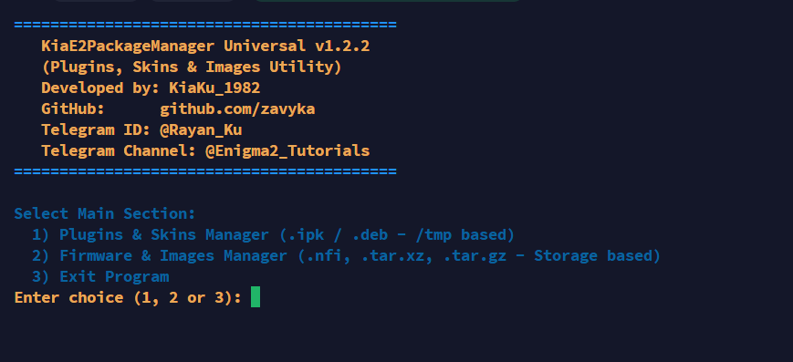

# KiaE2PackageManager

**Universal Package Manager for Enigma2 Satellite Receivers**

A powerful, all-in-one tool for managing plugins, skins, firmware images, and packages on Enigma2-based satellite receivers (Dreambox, VU+, GigaBlue, OpenATV, OpenPLi, DreamOS, and more).



🇺🇸 [English](#-english) | ☀️ [کوردی سۆرانی](#kurdish) | 🇮🇷 [فارسی](#-فارسی) | 🇸🇦 [العربية](#-العربية)

---

## 🇺🇸 English

### Features

- **Build & Recompile Packages** — Create `.deb` and `.ipk` packages from your plugin/skin projects
- **Extract & Unpack Packages** — Extract `.deb` and `.ipk` files with full structure preservation
- **Firmware Image Management** — Unpack and pack firmware images (`.nfi`, `.tar.xz`, `.tar.gz`, `.tar.bz2`)
- **Archive Operations** — Create compressed archives in multiple formats (`.zip`, `.tar`, `.tar.gz`, `.tar.xz`, `.tar.bz2`)
- **Auto-Detection** — Automatically detects receiver architecture (ARM, ARM64, MIPS, x86/x64)
- **Universal Compatibility** — Works with Python 2.7+ and Python 3.x
- **No Dependencies** — Uses only standard system tools, no external packages required
- **Package Validation** — Built-in validation to verify package integrity before installation

### Supported Receivers (Hardware)

| Brand | Models |
|-------|--------|
| Dreambox | DM800, DM8000, DM900, DM920, DM520, DM500HD |
| VU+ | Duo, Duo2, Duo4K, Solo, Solo2, Solo4K, Ultimo, Ultimo4K |
| GigaBlue | All Enigma2-based models |
| Other | Any receiver running Enigma2 |

### Supported Operating Systems

| OS | Versions |
|----|----------|
| DreamOS | OE 2.2, OE 2.5, OE 2.6 |
| OE2.0 | Open Embedded |

### Supported Images

| Image | Description |
|-------|-------------|
| CVS | Clean base version (no modifications) |
| AIO | All-In-One |
| Custom | Images based on CVS and AIO |
| OpenATV | Open source |
| OpenPLi | Open source |
| Other | Any Enigma2 image |

### Supported Package Formats

| Format | Description | Usage |
|--------|-------------|-------|
| `.deb` | Debian package | Dreambox / DreamOS receivers |
| `.ipk` | IPK package | OpenATV / OpenPLi / OE2.0 receivers |
| `.tar.xz` | Compressed tar archive | General firmware/software |
| `.tar.gz` | Gzip compressed tar | General firmware/software |
| `.tar.bz2` | Bzip2 compressed tar | General firmware/software |
| `.nfi` | NFI firmware image | Dreambox firmware updates |
| `.zip` | ZIP archive | General file compression |

### Installation & Usage

There are 3 ways to install and run the tool on your receiver:

| Method | For Who | What You Need |
|--------|---------|---------------|
| **Method 1** | Everyone | Just SSH access to your receiver |
| **Method 2** | Advanced users | PC + Terminal/Command Prompt |
| **Method 3** | Beginners | PC + GUI tools (FileZilla/WinSCP) |

---

#### Method 1: Direct Download on Receiver (Easiest)

> **Best for:** Users who just want to quickly run the tool
> **Requirements:** SSH access to your receiver (Putty, terminal, etc.)

Simply connect to your receiver via SSH and run these commands. The tool will be downloaded directly from GitHub to your receiver.

```bash
wget -O /tmp/KiaE2PackageManager https://raw.githubusercontent.com/zavyka/KiaE2PackageManager/main/KiaE2PackageManager
chmod +x /tmp/KiaE2PackageManager
/tmp/KiaE2PackageManager
```

---

#### Method 2: Transfer from PC via SCP (Command Line)

> **Best for:** Advanced users comfortable with terminal/command line
> **Requirements:** PC with terminal + SSH access to receiver

First, download the file on your PC, then use the `scp` command to transfer it to your receiver:

```bash
# Step 1: Run this on your PC (not on receiver)
scp KiaE2PackageManager root@<receiver_ip>:/tmp/

# Step 2: Connect to receiver and run
ssh root@<receiver_ip>
chmod +x /tmp/KiaE2PackageManager
/tmp/KiaE2PackageManager
```

---

#### Method 3: Transfer with GUI Tools (No Command Line)

> **Best for:** Beginners who prefer visual interfaces (mouse click)
> **Requirements:** PC with FileZilla or WinSCP

If you're not comfortable with command line, use these GUI tools to transfer the file by dragging and dropping:

**Step 1: Transfer the file to your receiver**

You can use any of these tools to copy `KiaE2PackageManager` to the `/tmp/` folder on your receiver:

| Tool | Protocol | Instructions |
|------|----------|-------------|
| **FileZilla** | FTP | Connect to `<receiver_ip>:21` → Navigate to `/tmp/` → Drag & drop the file |
| **WinSCP** | SCP/SFTP | Connect to `<receiver_ip>` (port 22) → Navigate to `/tmp/` → Drag & drop the file |
| **Putty (PSCP)** | SCP | Run: `pscp KiaE2PackageManager root@<receiver_ip>:/tmp/` |
| **Total Commander** | FTP/SCP | Use FTP or SCP plugin → Navigate to `/tmp/` → Upload file |

**Step 2: Connect via SSH and run**

Open **Putty** (or any SSH client) and connect to your receiver:

```
Host Name: <receiver_ip>
Port: 22
Connection Type: SSH
```

Login with:
```
Username: root
Password: dreambox
```

Then run these commands:

```bash
cd /tmp
chmod +x KiaE2PackageManager
./KiaE2PackageManager
```

> **Tip:** You can also use Putty's built-in SCP feature to transfer files directly.

### Usage Guide

#### Main Menu

When you run the tool, you'll see the main menu:

```
==========================================
   KiaE2PackageManager Universal v1.2.2
   (Plugins, Skins & Images Utility)
==========================================

Select Main Section:
  1) Plugins & Skins Manager (.ipk / .deb - /tmp based)
  2) Firmware & Images Manager (.nfi, .tar.xz, .tar.gz - Storage based)
  3) Exit Program
```

#### Option 1: Plugins & Skins Manager

**Building a Package:**

1. Select `1` from the main menu
2. Select `1` (Build / Recompile Package)
3. Choose your output format:
   - `1` — `.deb` (for Dreambox / DreamOS)
   - `2` — `.ipk` (for OpenATV / OpenPLi / OE2.0)
   - `3` — Both formats
4. The tool will scan `/tmp/` for project folders containing `usr` directory
5. Select your project folder or enter a custom path
6. Edit the control file if needed (package name, version, architecture, etc.)
7. Choose filename mode (original name or standard naming)
8. Wait for the build to complete
9. Optionally run validation test

> **⚠️ Important:** Before building, make sure all plugin/skin files are placed in the correct directory structure (e.g., `usr/lib/enigma2/python/Plugins/` for plugins, `usr/share/enigma2/` for skins). Incorrect file paths will cause the package to malfunction after installation.

**Extracting a Package:**

1. Select `1` from the main menu
2. Select `2` (Unpack / Extract Package)
3. The tool will scan `/tmp/` for `.deb` and `.ipk` files
4. Select your package or enter a custom path
5. The extracted files will be saved in `/tmp/<package_name>_extracted/`

#### Option 2: Firmware & Images Manager

**Unpacking a Firmware Image:**

1. Select `2` from the main menu
2. Select `1` (Unpack Image / Archive)
3. The tool will scan storage for supported image files
4. Select your image file or enter a custom path
5. Choose extraction destination
6. Wait for extraction to complete

> **⚠️ Important:** Extracted firmware images can be very large (several GB). It is recommended to save them on a **micro SD card**, **external hard drive**, or **USB flash memory** instead of the receiver's internal storage to avoid running out of space.

**Creating an Archive:**

1. Select `2` from the main menu
2. Select `2` (Pack / Compress Folder)
3. Select the folder you want to compress
4. Choose output format (`.zip`, `.tar`, `.tar.gz`, `.tar.xz`, `.tar.bz2`)
5. Wait for compression to complete

### Project Structure (for Building Packages)

When building `.deb` or `.ipk` packages, your project folder should have this structure:

```
your_project/
├── DEBIAN/           # or CONTROL/
│   └── control       # Package metadata
├── usr/
│   ├── bin/          # Executables
│   ├── lib/          # Libraries
│   ├── share/        # Data files
│   └── ...
└── ...
```

Example `control` file:
```
Package: enigma2-plugin-skins-myskin
Version: 1.0
Architecture: all
Section: base
Priority: optional
Maintainer: Your Name <your@email.com>
Description: My Awesome Skin for Enigma2
 This is a beautiful skin for Enigma2 receivers.
Depends: enigma2
```

### Troubleshooting

| Problem | Solution |
|---------|----------|
| "Python not found" | Install Python: `opkg install python` or `apt-get install python3` |
| "Permission denied" | Run `chmod +x KiaE2PackageManager` |
| Package build fails | Check that your project folder has correct structure with `DEBIAN/control` |
| Validation fails | Ensure your package contains `control.tar` and `data.tar` |
| Archive extraction fails | Check if the file is corrupted or in unsupported format |
| Cannot connect via SSH | Make sure SSH server is running on receiver (install: `opkg install openssh`) |

### Developer Information

- **Developer:** KiaKu_1982
- **GitHub:** [github.com/zavyka](https://github.com/zavyka)
- **Telegram:** [@Rayan_Ku](https://t.me/Rayan_Ku)
- **Channel:** [@Enigma2_Tutorials](https://t.me/Enigma2_Tutorials)

### 🌟 Support & Star

If you found this tool helpful, please:

- ⭐ **Star** the project on [GitHub](https://github.com/zavyka)
- 📢 **Share** it on:
  - [Telegram](https://t.me/Rayan_Ku)
  - [Facebook](https://www.facebook.com/)
  - [X (Twitter)](https://x.com/)
  - Enigma2 Forums
  - Satellite Receiver Groups
  - Any other platform
- 🐛 **Report issues** if you find any bugs at [Issues](https://github.com/zavyka/KiaE2PackageManager/issues)

By sharing this tool, you help other Enigma2 users discover it!

### License

MIT License

---

### 🌐 Switch Language
🇺🇸 English | ☀️ [کوردی سۆرانی](#kurdish) | 🇮🇷 [فارسی](#-فارسی) | 🇸🇦 [العربية](#-العربية)

---

## <a id="kurdish"></a> ☀️ کوردی سۆرانی

### تایبەتمەندییەکان

- **دروستکردن و دروست کردنەوەی پاکێج** — دروستکردنی فایلەکانی `.deb` و `.ipk` لە پرۆژەکانی پڵاگین/سکینی خۆتان
- **دەرهێنان و کردنەوەی پاکێج** — دەرهێنانی فایلەکانی `.deb` و `.ipk` لەگەڵ پاراستنی تەواوی پێکهاتە
- **بەڕێوەبردنی فیرموێر** — کردنەوە و پێچانەوەی وێنەکانی فیرموێر (`.nfi`, `.tar.xz`, `.tar.gz`, `.tar.bz2`)
- **کارکردن لەگەڵ ئەرشیف** — دروستکردنی ئەرشیفی گوشراو بە فۆڕماتە جیاوازەکان (`.zip`, `.tar`, `.tar.gz`, `.tar.xz`, `.tar.bz2`)
- **ناسینەوەی خۆکار** — ناسینەوەی خۆکاری مێعماری وەرگر(رێسیڤێر) (ARM, ARM64, MIPS, x86/x64)
- **سازگاری جیهانی** — کاردەکات لەسەر <span dir="ltr">Python 2.7+</span> و <span dir="ltr">Python 3.x</span>
- **بێ پێویستی بە پاڵپشتی** — تەنها ئامرازە ستانداردەکانی سیستەم بەکاردەهێنێت
- **پشکنینی پاکێج** — پشکنینی ناوخۆیی بۆ دڵنیابوون لە دروستی پاکێج پێش دامەزراندن

### وەرگر(رێسیڤێر)ە پاڵپشتیکراوەکان (هێڵەکان)

| براند | مۆدێلەکان |
|-------|-----------|
| <span dir="ltr">Dreambox</span> | <span dir="ltr">DM800, DM8000, DM900, DM920, DM520, DM500HD</span> |
| <span dir="ltr">VU+</span> | <span dir="ltr">Duo, Duo2, Duo4K, Solo, Solo2, Solo4K, Ultimo, Ultimo4K</span> |
| <span dir="ltr">GigaBlue</span> | هەموو مۆدێلەکانی بنەمای <span dir="ltr">Enigma2</span> |
| ئیتر | هەر وەرگرێک بە سیستەمی کارپێکردنی <span dir="ltr">Enigma2</span> |

### سیستەمەکانی کارپێکردنی پاڵپشتیکراوەکان

| سیستەم | نوێنەرەکان |
|--------|------------|
| <span dir="ltr">DreamOS</span> | <span dir="ltr">OE 2.2, OE 2.5, OE 2.6</span> |
| <span dir="ltr">OE2.0</span> | <span dir="ltr">Open Embedded</span> |

### وێنەکانی پاڵپشتیکراوەکان

| وێنە | وەسف |
|------|------|
| <span dir="ltr">CVS</span> | وێنەی سەرەتایی پاڕاستراو (بێ دەستکاری) |
| <span dir="ltr">AIO</span> | <span dir="ltr">All-In-One</span> |
| نێوانە | وێنەکانی سەربنەمای <span dir="ltr">CVS</span> و <span dir="ltr">AIO</span> |
| <span dir="ltr">OpenATV</span> | مەڵتی-کەیی |
| <span dir="ltr">OpenPLi</span> | مەڵتی-کەیی |
| ئیتر | هەر وێنەیەکی <span dir="ltr">Enigma2</span> |

### فۆرماتە پاڵپشتیکراوەکانی پاکێج

| فۆرمات | وەسف | بەکارهێنان |
|--------|------|-----------|
| <span dir="ltr">`.deb`</span> | پاکێجی <span dir="ltr">Debian</span> | وەرگر(رێسیڤێر)ەکانی <span dir="ltr">Dreambox</span> / <span dir="ltr">DreamOS</span> |
| <span dir="ltr">`.ipk`</span> | پاکێجی <span dir="ltr">IPK</span> | وەرگر(رێسیڤێر)ەکانی <span dir="ltr">OpenATV</span> / <span dir="ltr">OpenPLi</span> / <span dir="ltr">OE2.0</span> |
| <span dir="ltr">`.tar.xz`</span> | ئەرشیفی گوشراوی <span dir="ltr">tar</span> | فیرموێر/نەرمەواڵە گشتییەکان |
| <span dir="ltr">`.tar.gz`</span> | <span dir="ltr">tar</span> گوشراو بە <span dir="ltr">gzip</span> | فیرموێر/نەرمەواڵە گشتییەکان |
| <span dir="ltr">`.tar.bz2`</span> | <span dir="ltr">tar</span> گوشراو بە <span dir="ltr">bzip2</span> | فیرموێر/نەرمەواڵە گشتییەکان |
| <span dir="ltr">`.nfi`</span> | وێنەی فیرموێری <span dir="ltr">NFI</span> | نوێکردنەوەی فیرموێری <span dir="ltr">Dreambox</span> |
| <span dir="ltr">`.zip`</span> | ئەرشیفی <span dir="ltr">ZIP</span> | گوشینی فایلە گشتییەکان |

### دامەزراندن و بەکارهێنان

٣ ڕێگا هەیە بۆ دامەزراندن و جێبەجێکردن:

| ڕێگا | بۆ کێیە؟ | چی پێویستە؟ |
|------|---------|-------------|
| **ڕێگای ١** | هەموو کەس | تەنها دەستگەیشتن بە <span dir="ltr">SSH</span> بۆ وەرگر(رێسیڤێر) |
| **ڕێگای ٢** | بەکارهێنەرانی پێشکەوتوو | کۆمپیوتەر + <span dir="ltr">Terminal</span> |
| **ڕێگای ٣** | بەکارهێنەرانی سەرەتایی | کۆمپیوتەر + نەرمەواڵی گرافیکی (<span dir="ltr">FileZilla</span>/<span dir="ltr">WinSCP</span>) |

---

#### ڕێگای ١: داگرتنی ڕاستەوخۆ لەسەر وەرگر(رێسیڤێر) (ئاسانترین)

> **باشترین بۆ:** ئەوانەی دەیانەوێت خێرا ئامرازەکە جێبەجێ بکەن
> **پێویستە:** دەستگەیشتن بە SSH بۆ وەرگر(رێسیڤێر) (<span dir="ltr">Putty</span>، <span dir="ltr">Terminal</span> و هتد)

تەنها بە SSH پەیوەندی بە وەرگر(رێسیڤێر)ەوە بکەن و ئەم فەرمانانە جێبەجێ بکەن. ئامرازەکە ڕاستەوخۆ لە <span dir="ltr">GitHub</span> بۆ وەرگر(رێسیڤێر) دادەگیرێت:

```bash
wget -O /tmp/KiaE2PackageManager https://raw.githubusercontent.com/zavyka/KiaE2PackageManager/main/KiaE2PackageManager
chmod +x /tmp/KiaE2PackageManager
/tmp/KiaE2PackageManager
```

---

#### ڕێگای ٢: گواستنەوە لە کۆمپیوتەر بە SCP (هێڵی فەرمان)

> **باشترین بۆ:** بەکارهێنەرانی پێشکەوتوو کە شارەزای <span dir="ltr">Terminal</span> ـن
> **پێویستە:** کۆمپیوتەر لەگەڵ <span dir="ltr">Terminal</span> + دەستگەیشتن بە SSH بۆ وەرگر(رێسیڤێر)

سەرەتا فایلەکە لەسەر کۆمپیوتەر دابگرن، پاشان بە فەرمانی `scp` بۆ وەرگر(رێسیڤێر) بیگوازنەوە:

```bash
scp KiaE2PackageManager root@<receiver_ip>:/tmp/

ssh root@<receiver_ip>
chmod +x /tmp/KiaE2PackageManager
/tmp/KiaE2PackageManager
```

---

#### ڕێگای ٣: گواستنەوە بە نەرمەواڵە گرافیکییەکان (بێ هێڵی فەرمان)

> **باشترین بۆ:** بەکارهێنەرانی سەرەتایی کە پێیان خۆشە بە ماوس کار بکەن
> **پێویستە:** کۆمپیوتەر لەگەڵ <span dir="ltr">FileZilla</span> یان <span dir="ltr">WinSCP</span>

ئەگەر شارەزا بە هێڵی فەرمان (<span dir="ltr">Command Line</span>) نین، ئەم نەرمەواڵانە بەکاربهێنن بۆ گواستنەوەی فایل بە ڕاکێشان و دانان (<span dir="ltr">Drag & Drop</span>):

**هەنگاوی ١: گواستنەوەی فایل بۆ وەرگر(رێسیڤێر)**

بە هەر یەکێک لەم نەرمەواڵانە دەتوانن فایلەکەی `KiaE2PackageManager` بۆ بوخچەی `/tmp/` لەسەر وەرگر(رێسیڤێر) کۆپی بکەن:

| نەرمەواڵ | پرۆتۆکۆڵ | ڕێنمایی |
|----------|-----------|---------|
| **<span dir="ltr">FileZilla</span>** | FTP | پەیوەستبوون بە `<receiver_ip>:21` → چوون بۆ `/tmp/` → ڕاکێشان و دانانی فایل |
| **<span dir="ltr">WinSCP</span>** | SCP/SFTP | پەیوەستبوون بە `<receiver_ip>` (پۆرتی 22) → چوون بۆ `/tmp/` → ڕاکێشان و دانانی فایل |
| **<span dir="ltr">Putty (PSCP)</span>** | SCP | جێبەجێکردنی فەرمان: `pscp KiaE2PackageManager root@<receiver_ip>:/tmp/` |
| **<span dir="ltr">Total Commander</span>** | <span dir="ltr">FTP/SCP</span> | بەکارهێنانی پێوەکراوی <span dir="ltr">FTP</span> یان <span dir="ltr">SCP</span> → چوون بۆ `/tmp/` → بارکردنی فایل |

**هەنگاوی ٢: پەیوەستبوون بە SSH و جێبەجێکردن**

<span dir="ltr">Putty</span> (یان هەر <span dir="ltr">SSH Client</span> ـێکی تر) بکەرەوە و بە وەرگر(رێسیڤێر) پەیوەست ببە:

```
Host Name: <receiver_ip>
Port: 22
Connection Type: SSH
```

چوونەژوورەوە بە:
```
Username: root
Password: dreambox
```

پاشان ئەم فەرمانانە جێبەجێ بکە:

```bash
cd /tmp
chmod +x KiaE2PackageManager
./KiaE2PackageManager
```

> **تێبینی:** هەروەها دەتوانیت لە تایبەتمەندی <span dir="ltr">SCP</span> ـی ناوخۆی <span dir="ltr">Putty</span> بۆ گواستنەوەی ڕاستەوخۆی فایلەکانیش بەکاربهێنیت.

### ڕێنمایی بەکارهێنان

#### پێڕستی سەرەکی

```
==========================================
   KiaE2PackageManager Universal v1.2.2
   (ئامرازی بەڕێوەبردنی پڵاگین، سکین و وێنەکان)
==========================================

هەڵبژاردنی بەشی سەرەکی:
  1) بەڕێوەبردنی پڵاگین و سکین (.ipk / .deb)
  2) بەڕێوەبردنی فیرموێر و وێنەکان (.nfi, .tar.xz, .tar.gz)
  3) دەرچوون لە بەرنامە
```

#### هەڵبژاردەی ١: بەڕێوەبردنی پڵاگین و سکین

**دروستکردنی پاکێج:**

1. هەڵبژاردەی `1` لە پێڕستی سەرەکی هەڵبژێرە.
2. هەڵبژاردەی `1` (دروستکردن / دروست کردنەوەی پاکێج) هەڵبژێرە.
3. فۆڕماتی دەرچوون هەڵبژێرە:
   - `1` — `.deb` (بۆ Dreambox / DreamOS)
   - `2` — `.ipk` (بۆ OpenATV / OpenPLi / OE2.0)
   - `3` — هەردوو فۆڕمات
4. ئامرازەکە بوخچەکانی پرۆژە لە `/tmp/` دەپشکنێ.
5. بوخچەی پرۆژەکەت هەڵبژێرە.

> **⚠️ گرنگ:** پێش دروستکردنی پاکێج، دڵنیابە کە هەموو فایلەکانی پڵاگین/سکین لە شوێنی دروست دانراون (بۆ نموونە: `usr/lib/enigma2/python/Plugins/` بۆ پڵاگینەکان و `usr/share/enigma2/` بۆ سکینەکان). ڕێڕەوی هەڵە دەبێتە هۆی ئەوەی پاکێجەکە دوای دامەزراندن بە دروستی کار نەکات.

6. ئەگەر پێویست بوو، فایلەکەی `control` دەستکاری بکە.
7. چاوەڕوانی تەواوبوونی دروستکردن بکە.

**دەرهێنانی پاکێج:**

1. هەڵبژاردەی `1` لە پێڕستی سەرەکی هەڵبژێرە.
2. هەڵبژاردەی `2` (کردنەوە / دەرهێنانی پاکێج) هەڵبژێرە.
3. فایلە پاکێجەکە هەڵبژێرە.
4. فایلە دەرهێنراوەکان لە `/tmp/<package_name>_extracted/` پاشەکەوت دەکرێن.

---

#### هەڵبژاردەی ٢: بەڕێوەبردنی فیرموێر و وێنەکان

**کردنەوەی وێنەی فیرموێر:**

1. هەڵبژاردەی `2` لە پێڕستی سەرەکی هەڵبژێرە.
2. هەڵبژاردەی `1` (کردنەوەی وێنە / ئەرشیف) هەڵبژێرە.
3. فایلە وێنەکە هەڵبژێرە.
4. شوێنی دەرهێنان هەڵبژێرە.

> **⚠️ گرنگ:** فایلەکانی فیرموێر دوای دەرهێنان قەبارەیەکی زۆر گەورەیان دەبێت (چەندین گیگابایت). پێشنیار دەکرێت لەسەر کارتی Micro SD یان هارد دیسکی دەرەکی یان Flash Memory پاشەکەوتیان بکەن، بۆ ئەوەی بۆشایی ناوخۆیی وەرگر(رێسیڤێر) پڕ نەبێتەوە.

**دروستکردنی ئەرشیف:**

1. هەڵبژاردەی `2` لە پێڕستی سەرەکی هەڵبژێرە.
2. هەڵبژاردەی `2` (پێچانەوە / گوشینی بوخچە) هەڵبژێرە.
3. بوخچەی مەبەست هەڵبژێرە.
4. فۆڕماتی دەرچوون هەڵبژێرە.

### چارەسەرکردنی کێشەکان

| کێشە | چارەسەر |
|------|---------|
| "Python not found" | <span dir="ltr">Python</span> دابمەزرێنە: `<span dir="ltr">opkg install python</span>` |
| "Permission denied" | ئەم فەرمانە جێبەجێ بکە: `<span dir="ltr">chmod +x KiaE2PackageManager</span>` |
| هەڵە لە دروستکردنی پاکێج | پێکهاتەی بوخچەی پرۆژەکە بپشکنە |
| هەڵە لە پشکنینی پاکێج | دڵنیابە کە پاکێجەکە `<span dir="ltr">control.tar</span>` و `<span dir="ltr">data.tar</span>` لەخۆدەگرێت |
| ناتوانرێت بە <span dir="ltr">SSH</span> پەیوەندی بکرێت | دڵنیابە کە ڕاژەکاری <span dir="ltr">SSH</span> لەسەر وەرگر(رێسیڤێر) چالاکە (دامەزراندن: `<span dir="ltr">opkg install openssh</span>`) |

### زانیارییەکانی پەرەپێدەر

- **پەرەپێدەر:** KiaKu_1982
- **GitHub:** <span dir="ltr">[github.com/zavyka](https://github.com/zavyka)</span>
- **Telegram:** <span dir="ltr">[@Rayan_Ku](https://t.me/Rayan_Ku)</span>
- **کەناڵ:** <span dir="ltr">[@Enigma2_Tutorials](https://t.me/Enigma2_Tutorials)</span>

### 🌟 پاڵپشتی و ئەستێرەدان

ئەگەر ئەم ئامرازە بۆت بەسوود بوو، تکایە:

- ⭐ **ئەستێرەی پێبدە** لەسەر پرۆژەکە لە <span dir="ltr">[GitHub](https://github.com/zavyka/KiaE2PackageManager)</span>
- 📢 **هاوبەشی بکە** لە:
  - <span dir="ltr">[Telegram](https://t.me/Rayan_Ku)</span>
  - <span dir="ltr">[Facebook](https://www.facebook.com/)</span>
  - <span dir="ltr">[X (Twitter)](https://x.com/)</span>
  - مەڵبەند و ماڵپەڕەکانی <span dir="ltr">Enigma2</span>
  - گرووپەکانی وەرگری مانگی دەستکرد (ڕێسیڤێر)
  - هەر پلاتفۆرمێکی تریش
- 🐛 **کێشەکان ڕاپۆرت بکە** ئەگەر هەر باگێکت دۆزییەوە، لە <span dir="ltr">[Issues](https://github.com/zavyka/KiaE2PackageManager/issues)</span> ڕایبگەیەنە.

بە هاوبەشکردنی ئەم ئامرازە، یارمەتی بە بەکارهێنەرانی دیکەی <span dir="ltr">Enigma2</span> دەدەیت تا بتوانن بە ئاسانی بیدۆزنەوە.

### مۆڵەت

MIT License

---

### 🌐 زمانەکانی تێدا بگۆڕە
🇺🇸 [English](#-english) | ☀️ کوردی سۆرانی | 🇮🇷 [فارسی](#-فارسی) | 🇸🇦 [العربية](#-العربية)

---

## 🇮🇷 فارسی

### ویژگی‌ها

- **ساخت و بازسازی پکیج** — ایجاد فایل‌های `.deb` و `.ipk` از پروژه‌های پلاگین/اسکین شما
- **استخراج و بازکردن پکیج** — استخراج فایل‌های `.deb` و `.ipk` با حفظ ساختار کامل
- **مدیریت فریمور** — بازکردن و بسته تصاویر فریمور (`.nfi`, `.tar.xz`, `.tar.gz`, `.tar.bz2`)
- **عملیات آرشیو** — ایجاد آرشیوهای فشرده در فرمت‌های مختلف (`.zip`, `.tar`, `.tar.gz`, `.tar.xz`, `.tar.bz2`)
- **تشخیص خودکار** — تشخیص خودکار معماری گیرنده (ARM, ARM64, MIPS, x86/x64)
- **سازگاری جهانی** — کار با <span dir="ltr">Python 2.7+</span> و <span dir="ltr">Python 3.x</span>
- **بدون وابستگی** — فقط از ابزارهای استاندارد سیستم استفاده می‌کند
- **اعتبارسنجی پکیج** — اعتبارسنجی داخلی برای بررسی صحت پکیج قبل از نصب

### گیرنده‌های پشتیبانی شده (سخت‌افزار)

| برند | مدل‌ها |
|------|--------|
| <span dir="ltr">Dreambox</span> | <span dir="ltr">DM800, DM8000, DM900, DM920, DM520, DM500HD</span> |
| <span dir="ltr">VU+</span> | <span dir="ltr">Duo, Duo2, Duo4K, Solo, Solo2, Solo4K, Ultimo, Ultimo4K</span> |
| <span dir="ltr">GigaBlue</span> | تمام مدل‌های مبتنی بر <span dir="ltr">Enigma2</span> |
| سایر | هر گیرنده‌ای با سیستم‌عامل <span dir="ltr">Enigma2</span> |

### سیستم‌عامل‌های پشتیبانی شده

| سیستم‌عامل | نسخه‌ها |
|-----------|---------|
| <span dir="ltr">DreamOS</span> | <span dir="ltr">OE 2.2, OE 2.5, OE 2.6</span> |
| <span dir="ltr">OE2.0</span> | <span dir="ltr">Open Embedded</span> |

### ایمیج‌های پشتیبانی شده

| ایمیج | توضیح |
|-------|-------|
| <span dir="ltr">CVS</span> | نسخه پایه خام و رسمی (بدون دستکاری) |
| <span dir="ltr">AIO</span> | <span dir="ltr">All-In-One</span> |
| سایر | ایمیج‌هایی بر پایه <span dir="ltr">CVS</span> و <span dir="ltr">AIO</span> |
| <span dir="ltr">OpenATV</span> | متن‌باز |
| <span dir="ltr">OpenPLi</span> | متن‌باز |
| سایر | هر ایمیج <span dir="ltr">Enigma2</span> |

### فرمت‌های پکیج پشتیبانی شده

| فرمت | توضیح | کاربرد |
|------|-------|--------|
| <span dir="ltr">`.deb`</span> | پکیج <span dir="ltr">Debian</span> | گیرنده‌های <span dir="ltr">Dreambox</span> / <span dir="ltr">DreamOS</span> |
| <span dir="ltr">`.ipk`</span> | پکیج <span dir="ltr">IPK</span> | گیرنده‌های <span dir="ltr">OpenATV</span> / <span dir="ltr">OpenPLi</span> / <span dir="ltr">OE2.0</span> |
| <span dir="ltr">`.tar.xz`</span> | آرشیو فشرده <span dir="ltr">tar</span> | فریمور/نرم‌افزار عمومی |
| <span dir="ltr">`.tar.gz`</span> | <span dir="ltr">tar</span> فشرده با <span dir="ltr">gzip</span> | فریمور/نرم‌افزار عمومی |
| <span dir="ltr">`.tar.bz2`</span> | <span dir="ltr">tar</span> فشرده با <span dir="ltr">bzip2</span> | فریمور/نرم‌افزار عمومی |
| <span dir="ltr">`.nfi`</span> | تصویر فریمور <span dir="ltr">NFI</span> | بروزرسانی فریمور <span dir="ltr">Dreambox</span> |
| <span dir="ltr">`.zip`</span> | آرشیو <span dir="ltr">ZIP</span> | فشرده‌سازی فایل عمومی |

### نصب و استفاده

۳ روش برای نصب و اجرا وجود دارد:

| روش | برای چه کسی؟ | چه چیزی لازم است؟ |
|------|-------------|-------------------|
| **روش ۱** | هر کسی | فقط دسترسی SSH به گیرنده |
| **روش ۲** | کاربران حرفه‌ای | کامپیوتر + ترمینال |
| **روش ۳** | کاربران مبتدی | کامپیوتر + نرم‌افزار گرافیکی (<span dir="ltr">FileZilla</span>/<span dir="ltr">WinSCP</span>) |

---

#### روش ۱: دانلود مستقیم روی گیرنده (ساده‌ترین)

> **بهترین برای:** کسانی که می‌خواهند سریع ابزار را اجرا کنند
> **نیاز:** دسترسی SSH به گیرنده (<span dir="ltr">Putty</span>، ترمینال و غیره)

کافی است از طریق SSH به گیرنده وصل شوید و این دستورات را اجرا کنید. ابزار مستقیماً از <span dir="ltr">GitHub</span> روی گیرنده دانلود می‌شود:

```bash
wget -O /tmp/KiaE2PackageManager https://raw.githubusercontent.com/zavyka/KiaE2PackageManager/main/KiaE2PackageManager
chmod +x /tmp/KiaE2PackageManager
/tmp/KiaE2PackageManager
```

---

#### روش ۲: انتقال از کامپیوتر از طریق SCP (خط فرمان)

> **بهترین برای:** کاربران حرفه‌ای که با ترمینال آشنا هستند
> **نیاز:** کامپیوتر با ترمینال + دسترسی SSH به گیرنده

ابتدا فایل را روی کامپیوتر دانلود کنید، سپس با دستور `scp` به گیرنده منتقل کنید:

```bash
# مرحله ۱: این را روی کامپیوتر خود اجرا کنید (نه روی گیرنده)
scp KiaE2PackageManager root@<receiver_ip>:/tmp/

# مرحله ۲: به گیرنده وصل شوید و اجرا کنید
ssh root@<receiver_ip>
chmod +x /tmp/KiaE2PackageManager
/tmp/KiaE2PackageManager
```

---

#### روش ۳: انتقال با نرم‌افزارهای گرافیکی (بدون خط فرمان)

> **بهترین برای:** کاربران مبتدی که ترجیح می‌دهند با ماوس کار کنند
> **نیاز:** کامپیوتر با <span dir="ltr">FileZilla</span> یا <span dir="ltr">WinSCP</span>

اگر با خط فرمان آشنا نیستید، از این نرم‌افزارها برای انتقال فایل با کشیدن و رها کردن استفاده کنید:

**مرحله ۱: انتقال فایل به گیرنده**

از هر کدام از این نرم‌افزارها می‌توانید برای کپی کردن `KiaE2PackageManager` در پوشه `/tmp/` روی گیرنده استفاده کنید:

| نرم‌افزار | پروتکل | راهنما |
|----------|--------|-------|
| **<span dir="ltr">FileZilla</span>** | FTP | اتصال به `<receiver_ip>:21` → رفتن به `/tmp/` → کشیدن و رها کردن فایل |
| **<span dir="ltr">WinSCP</span>** | SCP/SFTP | اتصال به `<receiver_ip>` (پورت 22) → رفتن به `/tmp/` → کشیدن و رها کردن فایل |
| **<span dir="ltr">Putty (PSCP)</span>** | SCP | اجرای دستور: `pscp KiaE2PackageManager root@<receiver_ip>:/tmp/` |
| **<span dir="ltr">Total Commander</span>** | <span dir="ltr">FTP/SCP</span> | استفاده از افزونه <span dir="ltr">FTP</span> یا <span dir="ltr">SCP</span> → رفتن به `/tmp/` → آپلود فایل |

**مرحله ۲: اتصال از طریق SSH و اجرا**

<span dir="ltr">Putty</span> (یا هر کلاینت <span dir="ltr">SSH</span> دیگر) را باز کنید و به گیرنده متصل شوید:

```
Host Name: <receiver_ip>
Port: 22
Connection Type: SSH
```

ورود با:
```
Username: root
Password: dreambox
```

سپس دستورات زیر را اجرا کنید:

```bash
cd /tmp
chmod +x KiaE2PackageManager
./KiaE2PackageManager
```

> **نکته:** همچنین می‌توانید از قابلیت <span dir="ltr">SCP</span> داخلی <span dir="ltr">Putty</span> برای انتقال مستقیم فایل‌ها استفاده کنید.

### راهنمای استفاده

#### منوی اصلی

```
==========================================
   KiaE2PackageManager Universal v1.2.2
   (ابزار مدیریت پلاگین‌ها، اسکین‌ها و تصاویر)
==========================================

انتخاب بخش اصلی:
  1) مدیریت پلاگین‌ها و اسکین‌ها (.ipk / .deb)
  2) مدیریت فریمور و تصاویر (.nfi, .tar.xz, .tar.gz)
  3) خروج از برنامه
```

#### گزینه ۱: مدیریت پلاگین‌ها و اسکین‌ها

**ساخت پکیج:**
1. گزینه `1` را از منوی اصلی انتخاب کنید
2. گزینه `1` (ساخت / بازسازی پکیج) را انتخاب کنید
3. فرمت خروجی را انتخاب کنید:
   - `1` — `.deb` (برای Dreambox / DreamOS)
   - `2` — `.ipk` (برای OpenATV / OpenPLi / OE2.0)
   - `3` — هر دو فرمت
4. ابزار پوشه‌های پروژه در `/tmp/` را اسکن می‌کند
5. پوشه پروژه خود را انتخاب کنید

> **⚠️ مهم:** قبل از ساخت پکیج، مطمئن شوید که تمام فایل‌های پلاگین/اسکین در مسیر درست قرار گرفته‌اند (مثلاً: `usr/lib/enigma2/python/Plugins/` برای پلاگین‌ها، `usr/share/enigma2/` برای اسکین‌ها). مسیرهای نادرست باعث عدم عملکرد صحیح پکیج بعد از نصب می‌شوند.
6. فایل کنترل را در صورت نیاز ویرایش کنید
7. منتظر اتمام ساخت باشید

**استخراج پکیج:**
1. گزینه `1` را از منوی اصلی انتخاب کنید
2. گزینه `2` (بازکردن / استخراج پکیج) را انتخاب کنید
3. فایل پکیج را انتخاب کنید
4. فایل‌های استخراج شده در `/tmp/<نام_پکیج>_extracted/` ذخیره می‌شوند

#### گزینه ۲: مدیریت فریمور و تصاویر

**بازکردن تصویر فریمور:**
1. گزینه `2` را از منوی اصلی انتخاب کنید
2. گزینه `1` (بازکردن تصویر / آرشیو) را انتخاب کنید
3. فایل تصویر را انتخاب کنید
4. مقصد استخراج را انتخاب کنید

> **⚠️ مهم:** فایل‌های فریمور بعد از استخراج حجم بسیار بالایی دارند (چندین گیگابایت). توصیه می‌شود آنها را روی **کارت مایکرو SD** یا **هارد دیسک خارجی** یا **فلش مموری** ذخیره کنید تا فضای داخلی گیرنده تمام نشود.

**ایجاد آرشیو:**
1. گزینه `2` را از منوی اصلی انتخاب کنید
2. گزینه `2` (بسته‌بندی / فشرده‌سازی پوشه) را انتخاب کنید
3. پوشه مورد نظر را انتخاب کنید
4. فرمت خروجی را انتخاب کنید

### عیب‌یابی

| مشکل | راه‌حل |
|------|--------|
| "Python not found" | پایتون را نصب کنید: `<span dir="ltr">opkg install python</span>` |
| "Permission denied" | دستور `<span dir="ltr">chmod +x KiaE2PackageManager</span>` را اجرا کنید |
| خطا در ساخت پکیج | ساختار پوشه پروژه را بررسی کنید |
| خطا در اعتبارسنجی | مطمئن شوید پکیج شامل `<span dir="ltr">control.tar</span>` و `<span dir="ltr">data.tar</span>` است |
| عدم اتصال <span dir="ltr">SSH</span> | مطمئن شوید سرور <span dir="ltr">SSH</span> روی گیرنده فعال است (نصب: `<span dir="ltr">opkg install openssh</span>`) |

### اطلاعات توسعه‌دهنده

- **توسعه‌دهنده:** KiaKu_1982
- **گیت‌هاب:** <span dir="ltr">[github.com/zavyka](https://github.com/zavyka)</span>
- **تلگرام:** <span dir="ltr">[@Rayan_Ku](https://t.me/Rayan_Ku)</span>
- **کانال:** <span dir="ltr">[@Enigma2_Tutorials](https://t.me/Enigma2_Tutorials)</span>

### 🌟 حمایت و ستاره دان

اگر این ابزار برایتان مفید بود، لطفاً:

- ⭐ **ستاره بدهید** به پروژه در <span dir="ltr">[GitHub](https://github.com/zavyka)</span>
- 📢 **اشتراک بگذارید** در:
  - <span dir="ltr">[تلگرام](https://t.me/Rayan_Ku)</span>
  - <span dir="ltr">[فیسبوک](https://www.facebook.com/)</span>
  - <span dir="ltr">[X (توییتر)](https://x.com/)</span>
  - انجمن‌های <span dir="ltr">Enigma2</span>
  - گروه‌های گیرنده ماهواره
  - هر پلتفرم دیگری
- 🐛 **مشکلات را گزارش کنید** اگر باگی پیدا کردید در [Issues](https://github.com/zavyka/KiaE2PackageManager/issues)

با اشتراک‌گذاری این ابزار، به کاربران دیگر <span dir="ltr">Enigma2</span> کمک کنید تا آن را پیدا کنند!

### مجوز

مجوز MIT

---

### 🌐 تغییر زبان
🇺🇸 [English](#-english) | ☀️ [کوردی سۆرانی](#kurdish) | 🇮🇷 فارسی | 🇸🇦 [العربية](#-العربية)

---

## 🇸🇦 العربية

### الميزات

- **بناء وإعادة بناء الحزم** — إنشاء ملفات `.deb` و `.ipk` من مشاريع الإضافات والأ skins
- **استخراج وفك الحزم** — استخراج ملفات `.deb` و `.ipk` مع الحفظ الكامل للبنية
- **إدارة البرامج الثابتة** — فك وضغط صور البرامج الثابتة (`.nfi`, `.tar.xz`, `.tar.gz`, `.tar.bz2`)
- **عمليات الأرشيف** — إنشاء أرشيفات مضغوطة بتنسيقات متعددة (`.zip`, `.tar`, `.tar.gz`, `.tar.xz`, `.tar.bz2`)
- **كشف تلقائي** — كشف تلقائي لهيكل المستقبل (ARM, ARM64, MIPS, x86/x64)
- **توافق عالمي** — يعمل مع Python 2.7+ و Python 3.x
- **بدون تبعيات** — يستخدم فقط أدوات النظام الأساسية
- **التحقق من الحزم** — تحقق مدمج للتحقق من سلامة الحزم قبل التثبيت

### أجهزة الاستقبال المدعومة ( العتاد)

| العلامات التجارية | الطرازات |
|-----------------|----------|
| <span dir="ltr">Dreambox</span> | <span dir="ltr">DM800, DM8000, DM900, DM920, DM520, DM500HD</span> |
| <span dir="ltr">VU+</span> | <span dir="ltr">Duo, Duo2, Duo4K, Solo, Solo2, Solo4K, Ultimo, Ultimo4K</span> |
| <span dir="ltr">GigaBlue</span> | جميع الطرازات المبنية على <span dir="ltr">Enigma2</span> |
| أخرى | أي جهاز استقبال يعمل بنظام <span dir="ltr">Enigma2</span> |

### أنظمة التشغيل المدعومة

| نظام التشغيل | الإصدارات |
|-------------|-----------|
| <span dir="ltr">DreamOS</span> | <span dir="ltr">OE 2.2, OE 2.5, OE 2.6</span> |
| <span dir="ltr">OE2.0</span> | <span dir="ltr">Open Embedded</span> |

### الصور المدعومة

| الصورة | الوصف |
|--------|-------|
| <span dir="ltr">CVS</span> | النسخة الأساسية النقية (بدون تعديلات) |
| <span dir="ltr">AIO</span> | <span dir="ltr">All-In-One</span> |
| مخصص | صور مبنية على <span dir="ltr">CVS</span> و <span dir="ltr">AIO</span> |
| <span dir="ltr">OpenATV</span> | مفتوح المصدر |
| <span dir="ltr">OpenPLi</span> | مفتوح المصدر |
| أخرى | أي صورة <span dir="ltr">Enigma2</span> |

### تنسيقات الحزم المدعومة

| التنسيق | الوصف | الاستخدام |
|---------|-------|----------|
| <span dir="ltr">`.deb`</span> | حزمة <span dir="ltr">Debian</span> | أجهزة <span dir="ltr">Dreambox</span> / <span dir="ltr">DreamOS</span> |
| <span dir="ltr">`.ipk`</span> | حزمة <span dir="ltr">IPK</span> | أجهزة <span dir="ltr">OpenATV</span> / <span dir="ltr">OpenPLi</span> / <span dir="ltr">OE2.0</span> |
| <span dir="ltr">`.tar.xz`</span> | أرشيف <span dir="ltr">tar</span> مضغوط | البرامج الثابتة العامة |
| <span dir="ltr">`.tar.gz`</span> | <span dir="ltr">tar</span> مضغوط بـ <span dir="ltr">gzip</span> | البرامج الثابتة العامة |
| <span dir="ltr">`.tar.bz2`</span> | <span dir="ltr">tar</span> مضغوط بـ <span dir="ltr">bzip2</span> | البرامج الثابتة العامة |
| <span dir="ltr">`.nfi`</span> | صورة برنامج ثابت <span dir="ltr">NFI</span> | تحديثات برنامج <span dir="ltr">Dreambox</span> |
| <span dir="ltr">`.zip`</span> | أرشيف <span dir="ltr">ZIP</span> | ضغط الملفات العامة |

### التثبيت والاستخدام

هناك 3 طرق لتثبيت الأداة وتشغيلها على جهاز الاستقبال:

| الطريقة | لمن؟ | ماذا تحتاج؟ |
|---------|------|-------------|
| **الطريقة 1** | الجميع | فقط اتصال SSH بجهاز الاستقبال |
| **الطريقة 2** | المستخدمون المتقدمون | الكمبيوتر + موجه الأوامر |
| **الطريقة 3** | المبتدئون | الكمبيوتر + أدوات واجهة المستخدم الرسومية (<span dir="ltr">FileZilla</span>/<span dir="ltr">WinSCP</span>) |

---

#### الطريقة 1: التحميل المباشر على جهاز الاستقبال (أسهل طريقة)

> **الأفضل لـ:** الأشخاص الذين يريدون تشغيل الأداة بسرعة
> **المطلوب:** اتصال SSH بجهاز الاستقبال (<span dir="ltr">PuTTY</span>، موجه الأوامر، إلخ)

فقط اتصل بجهاز الاستقبال عبر SSH ونفّذ هذه الأوامر. سيتم تحميل الأداة مباشرة من <span dir="ltr">GitHub</span> على جهاز الاستقبال:

```bash
wget -O /tmp/KiaE2PackageManager https://raw.githubusercontent.com/zavyka/KiaE2PackageManager/main/KiaE2PackageManager
chmod +x /tmp/KiaE2PackageManager
/tmp/KiaE2PackageManager
```

---

#### الطريقة 2: النقل من الكمبيوتر عبر SCP (موجه الأوامر)

> **الأفضل لـ:** المستخدمون المتقدمون المعتادون على موجه الأوامر
> **المطلوب:** الكمبيوتر مع موجه الأوامر + اتصال SSH بجهاز الاستقبال

قم أولاً بتنزيل الملف على الكمبيوتر، ثم انقله إلى جهاز الاستقبال باستخدام أمر `scp`:

```bash
# الخطوة 1: نفّذ هذا على الكمبيوتر الخاص بك (وليس على جهاز الاستقبال)
scp KiaE2PackageManager root@<receiver_ip>:/tmp/

# الخطوة 2: اتصل بجهاز الاستقبال وشغّله
ssh root@<receiver_ip>
chmod +x /tmp/KiaE2PackageManager
/tmp/KiaE2PackageManager
```

---

#### الطريقة 3: النقل بأدوات واجهة المستخدم الرسومية (بدون موجه الأوامر)

> **الأفضل لـ:** المبتدئون الذين يفضلون استخدام الماوس
> **المطلوب:** الكمبيوتر مع <span dir="ltr">FileZilla</span> أو <span dir="ltr">WinSCP</span>

إذا لم تكن معتاداً على موجه الأوامر، استخدم هذه الأدوات الرسومية لنقل الملف بالسحب والإفلات:

**الخطوة 1: نقل الملف إلى جهاز الاستقبال**

يمكنك استخدام أي من هذه الأدوات لنسخ `KiaE2PackageManager` إلى المجلد `/tmp/` على جهاز الاستقبال:

| الأداة | البروتوكول | التعليمات |
|--------|-----------|----------|
| **<span dir="ltr">FileZilla</span>** | FTP | الاتصال بـ `<receiver_ip>:21` → الانتقال إلى `/tmp/` → سحب وإفلات الملف |
| **<span dir="ltr">WinSCP</span>** | SCP/SFTP | الاتصال بـ `<receiver_ip>` (منفذ 22) → الانتقال إلى `/tmp/` → سحب وإفلات الملف |
| **<span dir="ltr">Putty (PSCP)</span>** | SCP | تنفيذ الأمر: `pscp KiaE2PackageManager root@<receiver_ip>:/tmp/` |
| **Total Commander** | FTP/SCP | استخدام إضافة FTP أو SCP → الانتقال إلى `/tmp/` → رفع الملف |

**الخطوة 2: الاتصال عبر SSH والتشغيل**

افتح <span dir="ltr">Putty</span> (أي عميل <span dir="ltr">SSH</span> آخر) واتصل بجهاز الاستقبال:

```
Host Name: <receiver_ip>
Port: 22
Connection Type: SSH
```

تسجيل الدخول بـ:
```
Username: root
Password: dreambox
```

ثم نفذ الأوامر التالية:

```bash
cd /tmp
chmod +x KiaE2PackageManager
./KiaE2PackageManager
```

> **نصيحة:** يمكنك أيضًا استخدام ميزة <span dir="ltr">SCP</span> المدمجة في <span dir="ltr">Putty</span> لنقل الملفات مباشرة.

### دليل الاستخدام

#### القائمة الرئيسية

```
==========================================
   KiaE2PackageManager Universal v1.2.2
   (أداة إدارة الإضافات والأ skins والصور)
==========================================

اختر القسم الرئيسي:
  1) مدير الإضافات والأ skins (.ipk / .deb)
  2) مدير البرامج الثابتة والصور (.nfi, .tar.xz, .tar.gz)
  3) خروج من البرنامج
```

#### الخيار 1: مدير الإضافات والأ skins

**بناء حزمة:**
1. اختر `1` من القائمة الرئيسية
2. اختر `1` (بناء / إعادة بناء الحزمة)
3. اختر صيغة الإخراج
4. انتظر اكتمال البناء

> **⚠️ مهم:** قبل بناء الحزمة، تأكد من أن جميع ملفات الإضافات/A skins موجودة في المسار الصحيح (على سبيل المثال: `usr/lib/enigma2/python/Plugins/` للإضافات، `usr/share/enigma2/` للأ skins). المسارات الخاطئة ستجعل الحزمة لا تعمل بعد التثبيت.

**استخراج حزمة:**
1. اختر `1` من القائمة الرئيسية
2. اختر `2` (فك / استخراج الحزمة)
3. اختر ملف الحزمة
4. يتم حفظ الملفات المستخرجة في `/tmp/<اسم_الحزمة>_extracted/`

#### الخيار 2: مدير البرامج الثابتة والصور

**فك صورة برنامج ثابت:**
1. اختر `2` من القائمة الرئيسية
2. اختر `1` (فك صورة / أرشيف)
3. اختر ملف الصورة
4. اختر وجهة الاستخراج

> **⚠️ مهم:** ملفات البرامج الثابتة بعد الفك تكون كبيرة الحجم (عدة جيجابايت). يُنصح بحفظها على **بطاقة micro SD** أو **قرص خارجي** أو **ذاكرة USB** لتجنب نفاد مساحة التخزين الداخلية لجهاز الاستقبال.

**إنشاء أرشيف:**
1. اختر `2` من القائمة الرئيسية
2. اختر `2` (ضغط / حزم مجلد)
3. اختر المجلد المطلوب
4. اختر صيغة الإخراج

### استكشاف الأخطاء وإصلاحها

| المشكلة | الحل |
|---------|------|
| "Python not found" | ثبّت <span dir="ltr">Python</span>: `<span dir="ltr">opkg install python</span>` |
| "Permission denied" | نفّذ `<span dir="ltr">chmod +x KiaE2PackageManager</span>` |
| فشل بناء الحزمة | تحقق من بنية مجلد المشروع |
| فشل التحقق | تأكد من وجود `<span dir="ltr">control.tar</span>` و `<span dir="ltr">data.tar</span>` |
| فشل الاتصال بـ <span dir="ltr">SSH</span> | تأكد من تشغيل خادم <span dir="ltr">SSH</span> على جهاز الاستقبال (التثبيت: `<span dir="ltr">opkg install openssh</span>`) |

### معلومات المطور

- **المطور:** KiaKu_1982
- **GitHub:** <span dir="ltr">[github.com/zavyka](https://github.com/zavyka)</span>
- **Telegram:** <span dir="ltr">[@Rayan_Ku](https://t.me/Rayan_Ku)</span>
- **القناة:** <span dir="ltr">[@Enigma2_Tutorials](https://t.me/Enigma2_Tutorials)</span>

### 🌟 الدعم والتقييم

إذا وجدت هذه الأداة مفيدة، يرجى:

- ⭐ **تقييم** المشروع على <span dir="ltr">[GitHub](https://github.com/zavyka)</span>
- 📢 **مشاركة** الأداة على:
  - <span dir="ltr">[تيليجرام](https://t.me/Rayan_Ku)</span>
  - <span dir="ltr">[فيسبوك](https://www.facebook.com/)</span>
  - <span dir="ltr">[X (تويتر)](https://x.com/)</span>
  - منتديات <span dir="ltr">Enigma2</span>
  - مجموعات أجهزة الاستقبال الفضائية
  - أي منصة أخرى
- 🐛 **الإبلاغ عن المشاكل** إذا وجدت أي أخطاء في [Issues](https://github.com/zavyka/KiaE2PackageManager/issues)

بمشاركة هذه الأداة، تساعد مستخدمي <span dir="ltr">Enigma2</span> الآخرين في اكتشافها!

### الترخيص

رخصة MIT

---

### 🌐 تبديل اللغة
🇺🇸 [English](#-english) | ☀️ [کوردی سۆرانی](#kurdish) | 🇮🇷 [فارسی](#-فارسی) | 🇸🇦 العربية
